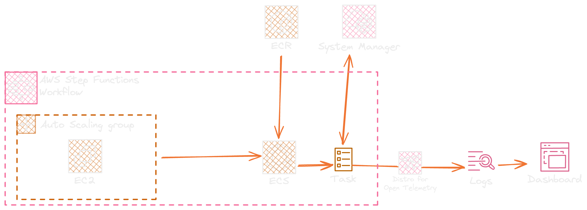

# K6 Executor Cluster

[](https://opensource.org/licenses/Apache-2.0)
[](https://www.typescriptlang.org/)
[](https://www.npmjs.com/package/@pacovk/k6-executor-cluster)
[](https://aws.amazon.com/cdk/)
[](https://k6.io)

A comprehensive AWS CDK construct library for deploying and running distributed K6 load tests on AWS infrastructure. This solution provides automated infrastructure provisioning, distributed test execution, real-time monitoring, and comprehensive observability for performance testing at scale.

## 🎯 Key Features

- **🏗️ Infrastructure as Code**: Complete AWS infrastructure provisioning using CDK
- **🔄 Distributed Load Testing**: Run K6 tests across multiple instances for scalable performance testing
- **📊 Real-time Monitoring**: CloudWatch dashboards with live metrics and performance insights
- **🔧 Auto-scaling**: Dynamic EC2 instance scaling based on test parallelism requirements
- **📈 OpenTelemetry Integration**: Comprehensive observability with OpenTelemetry Collector
- **🔐 Secure VCS Integration**: Support for GitHub and GitLab with secure token-based authentication
- **⚡ ARM64 Optimized**: Cost-effective ARM-based EC2 instances for better price-performance
- **🎛️ Configurable Parameters**: Flexible configuration for VUs, duration, parallelism, and more

## 🏗️ Architecture

The solution consists of several key components:



### Core Components

1. **Load Test Infrastructure**: ECS cluster with auto-scaling EC2 instances
2. **K6 Container**: Multi-container task with init, K6 execution, and observability
3. **Executor**: Step Functions-based orchestration with support for distributed execution
4. **Dashboard**: Real-time CloudWatch dashboard for monitoring test progress
5. **Auto Scaler**: Dynamic scaling of compute resources based on test requirements

## 🚀 Quick Start

### Prerequisites

- AWS CLI configured with appropriate permissions
- Node.js 18+ and npm/yarn
- Docker

### Installation

1. **Add dependency**:

```bash
npm install @pacovk/k6-executor-cluster
```

or when using `yarn`

```bash
yarn install @pacovk/k6-executor-cluster
```

2. **Configure your load test**

(see [example](./example/myExampleApp.ts))

```typescript
new K6LoadTest(app, "K6LoadTest", {
  loadTestConfig: {
    serviceName: "my-app",
    // ... other config
  },
  infrastructureConfig: {
    // ... infrastructure config
  },
});
```

5. **Deploy the stack**:
   ```bash
   npx cdk deploy <your-loadtest-stack>
   ```

## ⚙️ Configuration

### Load Test Configuration

Configure your load test parameters by modifying `bin/loadTest.ts`:

```typescript
const loadTestConfig: LoadTestConfig = {
  serviceName: "my-app", // Service name for metrics
  image: ContainerImage.fromRegistry("grafana/k6"), // K6 Docker image
  entrypoint: "tests/loadtest.ts", // Path to your test script
  vus: 10, // Number of virtual users
  duration: "5m", // Test duration
  parallelism: 2, // Number of parallel executors
  repository: {
    httpsCloneUrl: "https://github.com/user/repo.git",
    accessTokenSecretName: "github-token", // AWS SSM parameter name
    vcsProvider: VcsProvider.GITHUB, // or VcsProvider.GITLAB
  },
  secrets: {
    // Optional: Additional secrets
    API_KEY: "/path/to/ssm/parameter",
  },
  environmentVars: {
    // Optional: Environment variables
    BASE_URL: "https://api.example.com",
  },
  extraArgs: ["--quiet"], // Optional: Any additional K6 arguments
};
```

### Infrastructure Configuration

```typescript
const infrastructureConfig: InfrastructureConfig = {
  instanceType: InstanceType.of(InstanceClass.T4G, InstanceSize.MEDIUM),
  timeout: Duration.minutes(30), // Maximum test execution time
  memoryReservationMiB: 1024, // Initial mMemory for K6 container
  otelVersion: "0.123.0", // OpenTelemetry Collector version
  vpc: undefined, // Optional: Use existing VPC
};
```

### Runtime Parameters

Override configuration at deployment time using CDK context:

```bash
# Deploy with custom parameters
cdk deploy -c vus=50 -c duration=10m -c parallelism=5

# Or set in cdk.json
{
  "context": {
    "vus": 50,
    "duration": "10m",
    "parallelism": 5
  }
}
```

## 🔐 Security Setup

### Repository Access

1. **Create an access token** in your VCS provider (GitHub/GitLab)
2. **Store the token in AWS SSM Parameter Store**:
   ```bash
   aws ssm put-parameter \
     --name "/loadtest/github-token" \
     --value "your-token-here" \
     --type "SecureString"
   ```

### Additional Secrets

Store any additional secrets your tests need:

```bash
aws ssm put-parameter \
  --name "/loadtest/api-key" \
  --value "your-api-key" \
  --type "SecureString"
```

### VPC Integration

Deploy into an existing VPC:

```typescript
import { Vpc } from "aws-cdk-lib/aws-ec2";

const vpc = Vpc.fromLookup(this, "ExistingVpc", {
  vpcId: "vpc-12345678",
});

const infrastructureConfig: InfrastructureConfig = {
  // ... other config
  vpc: vpc,
};
```

## 📊 Monitoring & Observability

### CloudWatch Dashboard

The solution automatically creates a comprehensive CloudWatch dashboard with:

- **Performance Overview**: VUs, response times, request rates
- **HTTP Metrics**: Request count, failure rates, duration statistics
- **Transfer Rates**: Data sent/received over time
- **Iteration Metrics**: Test iteration performance

### Available Metrics

All metrics are published to CloudWatch under the `LOADTEST/K6` namespace:

- `vus`: Number of virtual users
- `http_req_duration`: HTTP request duration
- `http_reqs`: Number of HTTP requests
- `data_received`/`data_sent`: Data transfer metrics
- `iteration_duration`: Test iteration timing
- `FailedRequests`: Count of failed requests

## 🔄 Workflow

The load test execution follows this workflow:

1. **Infrastructure Scaling**: Auto Scaling Group scales out to required capacity
2. **Container Initialization**: Init container clones your test repository
3. **Distributed Execution**: Multiple K6 containers execute tests in parallel
4. **Metrics Collection**: OpenTelemetry Collector aggregates and exports metrics
5. **Infrastructure Cleanup**: Auto Scaling Group scales down to zero after completion

## 🛡️ Best Practices

### Resource Management

- Use ARM-based instances for performance and cost efficiency
- Set realistic timeouts to prevent runaway executions

## 🤝 Contributing

1. Fork the repository
2. Create a feature branch (`git checkout -b feature/amazing-feature`)
3. Commit your changes (`git commit -m 'Add some amazing feature'`)
4. Push to the branch (`git push origin feature/amazing-feature`)
5. Open a Pull Request

## 📄 License

This project is licensed under the Apache License 2.0 - see the [LICENSE.md](LICENSE.md) file for details.

## 🔗 Related Projects

- [K6](https://k6.io/) - Load testing framework
- [AWS CDK](https://aws.amazon.com/cdk/) - Infrastructure as Code
- [OpenTelemetry](https://opentelemetry.io/) - Observability framework

## 📞 Support

For questions and support:

- Check the issues page for known problems
- Create a new issue for bugs or feature requests
- Review the AWS CDK and K6 documentation for framework-specific questions

---

**Author**: [pascal.euhus](https://pascal.euhus.dev)